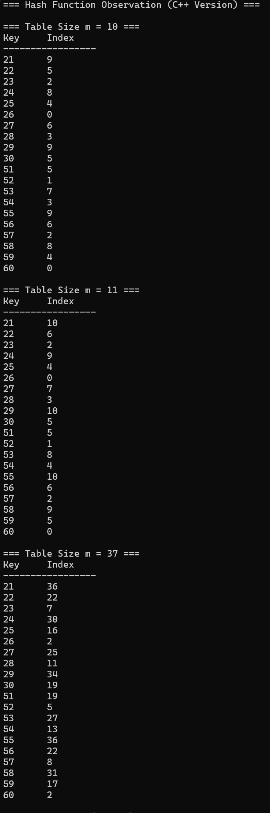
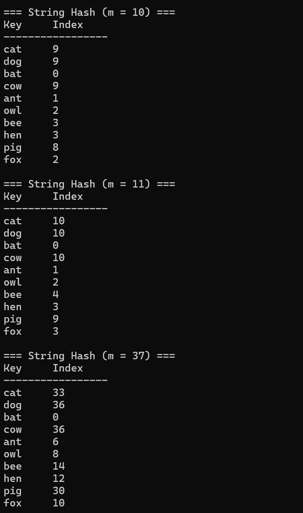
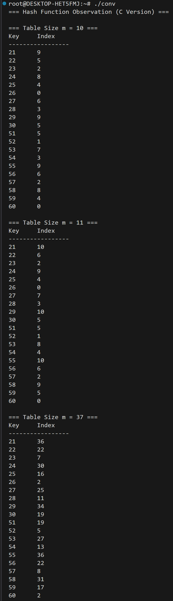
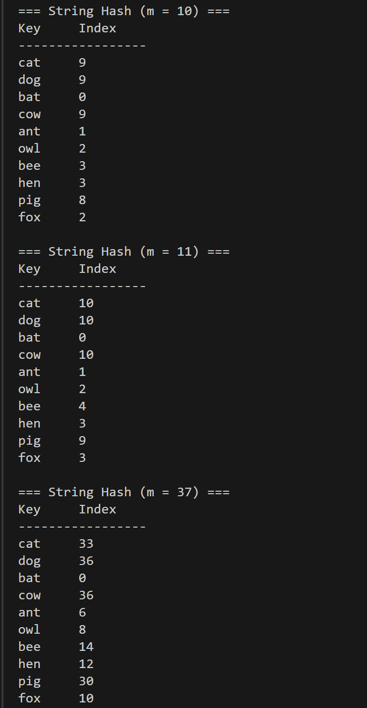

# Homework Assignment IV: Hash Function Design & Observation (C/C++ Version)
- Developer: Yu-Jia Wang 王郁佳 
- Email: <s1121430@mail.yzu.edu.tw> / <ariel940814@gmail.com> 
 ---
## My Hash Function (C++ Version)
- 我使用較常見的一種方法來做實作: **Multiplication Method**  
Multiplication method 是 Donald Knuth 在 TAOCP 中提出的 Hashing 方法。
使用「乘法 + 小數部分」來把 key **均勻分佈**到 Hash Table 中。
```text
    標準公式：h(k)=⌊m(kAmod1)⌋
    其中：
        - k = 你的 key（整數）
        - m = hash table 大小
        - A = 一個固定常數（0 < A < 1) 通常選 A = (√5 – 1)/2 = 0.6180339887...
          0.618...是黃金比例 φ 的小數部分，為 Knuth《TAOCP》證明過的最佳選擇之一
          黃金比例 φ 則是最不理性的無理數(最不可能與 key 發生同步 patterns 的數字)
```    
- Multiplication method的好處：  
1. Division method（% m）會很容易被看出規律，較適合去處理連續的 key 值。  
2. Multiplication method 則是透過「**小數部分**」去**破壞規律、避免週期性**，使處理過後的 key 值像亂數一樣分布。它**不依賴於 hash table 的大小**，可在 hash table 大小改變時保持較好的分布。
### Integer Keys 
- Formula / pseudocode:
  ```text
    int myHashInt(int key, int m) {
        if (m <= 0) //檢查 table sizes 不可 <= 0
            throw std::invalid_argument("table size m must be > 0");

        //Multiplication Method
        const double A = 0.618; // 黃金比例倒數
        double frac = (key * A)- floor(key * A); //只取小數部分不然數值太大
        return int(m * frac);
    }
  ```
- Rationale: h(k) = floor(m*(k*A mod 1)), 0 < A < 1 (研究顯示A 約 0.618時效果最好)

### Non-integer Keys
- Formula / pseudocode:
  ```text
    int myHashString(const std::string& str, int m) {
        unsigned long hash = 0;
        if (m <= 0) //檢查 table sizes 不可 <= 0
            throw std::invalid_argument("table size m must be > 0");
        if (str.empty()) //處理空字串，放到index=0
            return 0;

        //Multiplication Method
        const int base = 31;
        double A = 0.168;
        for (char c : str) //把字串轉成數字
            hash = hash * base + c; 
        double frac = hash*A - floor(hash*A); //取小數部分
        return int (m * frac);
    }
  ```
- Rationale: h(k) = floor(m*(k*A mod 1)), 0 < A < 1 (研究顯示A 約 0.618時效果最好)

## Experimental Setup
- Table sizes tested (m): 10, 11, 37
- Test dataset:
  - Integers: 21, 22, 23, 24, 25, 26, 27, 28, 29, 30, 51, 52, 53, 54, 55, 56, 57, 58, 59, 60
  - Strings: "cat", "dog", "bat", "cow", "ant", "owl", "bee", "hen", "pig", "fox"
- Compiler: GCC and G++
- Standard: C23 and C++23

## Results
### Initial - Division Method -> h(k) = k mod m
**Integer Hash**  
| Table Size (m) | Index Sequence | Collision Rate | Observation |
|----------------|----------------|----------------|-------------|
| 10 | 1,2,3,4,5,6,7,8,9,0,1,2,3,4,5,6,7,8,9,0 | 10/20=**50%** | **Pattern repeats every 10** |
| 11 | 10,0,1,2,3,4,5,6,7,8,7,8,9,10,0,1,2,3,4,5 | 9/20=**45%** | **More uniform** |
| 37 | 21,22,23,24,25,26,27,28,29,30,14,15,16,17,18,19,20,21,22,23 | 3/20=**15%** | **Near-uniform** |

**String Hash**  
| Table Size (m) | Index Sequence | **Collision Rate** | **Observation** |
|----------------|----------------|----------------|-------------|
| 10 | 0,0,0,0,0,0,0,0,0,0 | 9/10=**90%** | **All zero** |
| 11 | 0,0,0,0,0,0,0,0,0,0 | 9/10=**90%** | **All zero** |
| 37 | 0,0,0,0,0,0,0,0,0,0 | 9/10=**90%** | **All zero** |
 ---
### Multiplication Method -> h(k) = floor(m*(k*A mod 1))
**Integer Hash** 
| Table Size (m) | Index Sequence | **Collision Rate** | **Observation** |
|----------------|----------------|----------------|-------------|
| 10 | 9,5,2,8,4,0,6,3,9,5,5,1,7,3,9,6,2,8,4,0 | 10/20=**50%** | **Pattern repeats every 10** |
| 11 | 10,6,2,9,4,0,7,3,10,5,5,1,8,4,10,6,2,9,5,0 | 9/20=**45%** | **More uniform** |
| 37 | 36,22,7,30,16,2,25,11,34,19,19,5,27,13,36,22,8,31,17,2 | 4/20=**20%** | **Near-uniform** |

**String Hash**  
| Table Size (m) | Index Sequence | **Collision Rate** | **Observation** |
|----------------|----------------|----------------|-------------|
| 10 | 9,9,0,9,1,2,3,3,8,2 | 4/10=**40%** | **Partially uniform** |
| 11 | 10,10,0,10,1,2,4,3,9,3 | 3/10=**30%** | **Near-uniform** |
| 37 | 33,36,0,36,6,8,14,12,30,10 | 1/10=**10%** | **Near-uniform** |

## Compilation, Execution, and Output
### Compilation、Execution
- Command for C++: 
  ```bash
  Compile: g++ -std=c++17 -O2 main.cpp -o conv1
  Run: ./conv1
  ```
  - Command for C:
  ```bash
  Compile: gcc -std=c++17 -O2 main.c -o conv
  Run: ./conv
  ```
### Result Snapshot
 - C++ Version  
Example output for integers:  
  
Example output for strings:  


 - C Version  
Example output for integers:
  
Example output for strings:  


- Observations: 發現 table size 越大，結果越好(碰撞率越低)

## Analysis
- Integer Keys 分析
 1. 小的 table size（m = 10, 11）碰撞率高是一定的，因為總共有 20 個 keys，但可存的空間卻只有一半的大小。因此，無論使用 Division method 還是 Multiplication method，都會得到較高的碰撞率。
 2. m = 37 時出現「接近均勻」分布，m = 37 是質數，而且與 key pattern 沒有明顯週期關係，因此 Division 和 Multiplication 兩種方法都算「非常良好」，屬於 near-uniform。
 3. 至於 Division 的碰撞率在這個案例略低於 Multiplication，是因為 k mod 37 剛好把兩段 key 均攤地分散在不同 index 區間，這是數據上的自然巧合，不代表 Division method 總是比較好。
- String Keys 分析
 1. 結果顯示 table size 越大，結果越好(碰撞率越低)。
 2. 三個 table sizes 所得出的碰撞結果都不錯，因為 string keys 只有10個，不像 integer keys 有20個，與 table sizes 大小差距過大。
- 延伸
 1. 可添加一些無規律的 string keys，看由 Multiplication method 所做出的結果是不是比 Division method 還要好。
 2. 使用更多不同的 table sizes 去實作。

## Reflection
- Hash 函數的好壞，必須同時看「資料特性」與「m 的選擇」 
1. Division method **適合 m 為質數**、避免 key 有週期性。
2. Multiplication method 不依賴 m，對「相似key」表現比較穩定。
3. 但當資料量太少或 m 太小時，兩種方法差異不大。
- Division 與 Multiplication method 比較
1. Multiplication method 對**隨機資料**，分布會更均勻。
2. 而 Division method 較適合實作**規律資料**。
- Table size (m) 為質數與非質數
1. 在 Division method 中， table size 為質數或非質數會有很大的影響。若 table size 為質數，結果會好很多，因為可**避免「週期性」碰撞**，且可**避免「公因數問題」**，防止所有 key 都被映射到同一個 bucket。
2. Multiplication method 的分布品質較穩定，不太依賴 m 是否為質數。

## GitHub Upload
- Select the file tp upload
```bash
  git add Assignment/AssignmentIV
```
- Commit
```bash
  git commit -m "command..."
```
- Push
```bash
  git push origin main --force
```