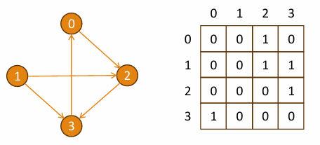
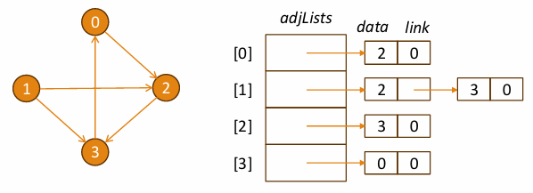

# Graphs(圖)

這份文件整理了圖 (Graphs) 這種資料結構的核心概念、術語、類型、表示法和遍歷演算法。

## 核心定義與概念

* **定義**：圖 $G=(V,E)$ 是一種由頂點 (Vertices) 集合 $V$ 和邊 (Edges) 集合 $E$ 組成的集合
    * **頂點 (V)**：也稱為節點 (nodes) 或點 (points)
    * **邊 (E)**：也稱為連結 (links) 或線 (lines)，代表實體之間的關係
* **特性**：
    * 圖可以有**循環 (cycles)**
    * 邊可以是**有向 (directed)** 或**無向 (undirected)**
    * 圖用於建模網路，例如社交關係、交通系統或網頁超連結
* **圖 vs. 樹**：
    * **樹**是一種特殊的圖：它是一個**連通的無環圖** (connected acyclic graph)
    * **樹**總是連通且具有階層性；**圖**可能不連通、可以有循環、無固有階層

---
## 圖的術語與類型 (Terminology & Classification)
### 邊的類型

| 類型 (Type) | 描述 (Description) | 範例 (Example) |
| :--- | :--- | :--- |
| **無向圖 (Undirected)** | 邊沒有方向 | 朋友網路 (Friendship network) |
| **有向圖 (Directed Graph / Digraph)** | 邊具有方向 | Instagram 的「追蹤」關係 |
| **加權圖 (Weighted Graph)** | 每條邊都有一個**成本 (cost)** (權重) | Google 地圖上的距離 |

### 圖的結構

| 類型 (Type) | 描述 (Description) | 範例 (Example) |
| :--- | :--- | :--- |
| **循環圖 (Cyclic Graph)** | 具有迴路 (loops) | [cite_start]城市環狀道路 |
| **無環圖 (Acyclic Graph)** | 沒有迴路 | 家族樹 (Family tree) |
| **連通圖 (Connected Graph)** | 每個節點都可以被到達 (reachable) | 道路網路 |
| **子圖 (Subgraph)** | $G'$ 是 $G$ 的子圖，滿足 $V(G') \subseteq V(G)$ 且 $E(G') \subseteq E(G)$ | |
| **同構 (Isomorphism)** | 兩個圖結構相同，僅標籤或繪製方式不同 | |

### Degree

* **無向圖 (Undirected)**：node的degree是與該node相連的邊數
* **有向圖 (Directed)**：
    * **In-degree**：指向該node的邊數 (該node是箭頭的頭)
    * **Out-degree**：從該node出發的邊數 (該node是箭頭的尾)

---
## 圖的表示

常用的圖表示法有兩種：鄰接矩陣和鄰接串列
### 鄰接矩陣 (Adjacency Matrix)

* **描述**：一個 $V \times V$ 的矩陣，記錄兩個頂點之間是否存在邊
* **優點 (Pros)**：
    * 邊查詢 (Edge lookup) 為 $O(1)$
    * 實作簡單
    * 適用於**稠密圖 (Dense graphs)** (邊很多)
* **缺點 (Cons)**：
    * 空間複雜度為 $O(V^2)$，對稀疏圖 (Sparse graphs) 來說非常浪費
    * 尋找所有鄰居需要掃描整行，為 $O(V)$
 
   

### 鄰接串列 (Adjacency List)

* **描述**：每個頂點只儲存其鄰居的串列
* **優點 (Pros)**：
    * 空間複雜度為 $O(V+E)$，**非常適合稀疏圖**
    * 鄰居迭代速度快，為 $O(\text{deg}(v))$
    * 對 BFS/DFS、Dijkstra 等演算法非常高效
    * 容易處理動態圖 (Dynamic graphs)
* **缺點 (Cons)**：
    * 檢查邊 $(u, v)$ 是否存在為 $O(\text{deg}(u))$
 
 

### 複雜度比較 (Time Complexity Comparison)

| Feature | Adjacency Matrix | Adjacency List |
| :--- | :--- | :--- |
| **Edge lookup** | $O(1)$ | $O(\text{deg}(v))$ |
| **Space** | $O(V^2)$ | $O(V+E)$ |
| **Traversal BFS/DFS** | $O(V^2)$ | $O(V+E)$ |
| **Neighbor iteration** | $O(V)$ | $O(\text{deg}(v))$ |
| **Best for** | Dense graphs | Sparse graphs |

---
## 圖的遍歷 (Graph Traversal)

圖的遍歷與樹的遍歷相似，但必須處理**循環**和**多條路徑**的問題

>**Graph traversal** = **Tree traversal** + **visited[ ]** (用於避免循環)

### 廣度優先搜尋 (Breadth-First Search, BFS)

* **用途**：類似於樹的**層級順序遍歷 (Level-order)**
* **資料結構**：使用**Queue** (遵循 First-in, First-out (FIFO) 原則)
* **演算法核心**：
    1.  將起點node加入queue和 `visited` 集合
    2.  當queue不空時，取出node $v$
    3.  如果 $v$ 未被訪問，則標記並輸出 $v$
    4.  將所有未訪問的鄰居加入queue

### 深度優先搜尋 (Depth-First Search, DFS)

* **用途**：類似於樹的**前序 (Preorder)** 遍歷
* **資料結構**：使用**堆疊 (Stack)** (用於路徑記憶和回溯)
* **演算法核心**：
    1.  將起點node壓入stack和 `visited` 集合
    2.  當stack不空時，從stack中取出node $v$
    3.  如果 $v$ 未被訪問，則標記並輸出 $v$
    4.  將所有未訪問的鄰居壓入stack

---
## 圖遍歷處理 (Traversal Handling)

圖的遍歷必須處理以下問題:

1.  **循環 (Cycles)**：必須追蹤 `visited` 節點以防止無限迴圈
2.  **多重進入路徑 (Multiple entry paths)**
3.  **任意拓撲 (Arbitrary topology)**
4.  **不連通分量 (Disconnected components)**：需要對每個分量執行 DFS/BFS
5.  **有向邊 (Directed edges)**：處理入度/出度
6.  **邊權重 (Edge weights)**：用於最短路徑問題 (如 Dijkstra)
