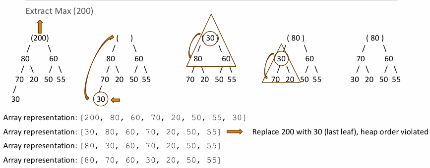

# Heaps

Heap 是一個**完全二元樹 (Complete Binary Tree)**，且滿足特定的順序屬性。

## Heap 類型

根據父節點與子節點的關係，可分為以下兩類：

| 類型 | 屬性 (Property) | 根節點 (Root) |
| :--- | :--- | :--- |
| **最大堆積 (Max Heap)** | 父節點的值 $\ge$ 子節點的值 | 儲存整棵樹的**最大值** |
| **最小堆積 (Min Heap)** | 父節點的值 $\le$ 子節點的值 | 儲存整棵樹的**最小值** |

---
## Array Representation

由於堆積是完全二元樹，使用**陣列 (Array)** 來儲存是最具效率的方式（不需指標記憶體）。

假設根節點索引為 `i` (通常從 1 開始)：
* **父節點索引**：`floor(i / 2)`
* **左子節點索引**：`2 * i`
* **右子節點索引**：`2 * i + 1`

---
## Heap Operations

### 插入 (Insertion)
1. 將新元素放置在完全二元樹的下一個空位（維持形狀屬性）。
2. **向上過濾 (Sift-up / Percolate-up)**：將該元素與其父節點比較，若違反順序屬性則交換，直到恢復平衡。

### 刪除根節點 (Deletion / Extract-Max or Min)
1. 移除根節點的值。
2. 將最後一個節點移至根節點位置（維持形狀屬性）。
3. **向下過濾 (Sift-down / Percolate-down)**：將新的根節點與子節點比較，與較大（Max Heap）或較小（Min Heap）的子節點交換，直到恢復平衡。

---
## 時間複雜度

| 操作 | 時間複雜度 | 說明 |
| :--- | :--- | :--- |
| **建立堆積 (build_heap(array))** | $O(n)$ | Convert array to heap |
| **插入 (insert(x))** | $O(\log n)$ | Add new element and restore heap-order |
| **刪除 (extract_root())** | $O(\log n)$ | Remove max (or min) element |
| **向下調整 (heapify(i))** | $O(\log n)$ | Restore heap property at node i |
| **獲取極值 (peek_root())** | $O(1)$ | Access max (or min) element |

---
## Applications

* **優先佇列 (Priority Queue)**：堆積是實現優先佇列最常用的資料結構。
* **堆積排序 (Heap Sort)**：一種基於堆積選擇性質的 $O(n \log n)$ 排序演算法。
* **尋找第 K 個最大/最小值**：利用堆積可以高效完成。
