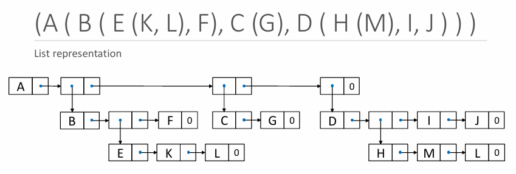
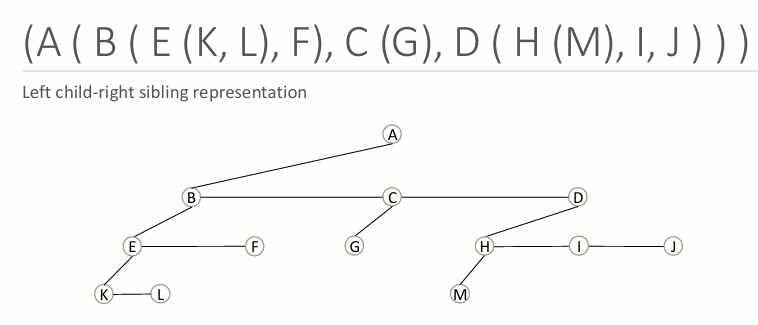
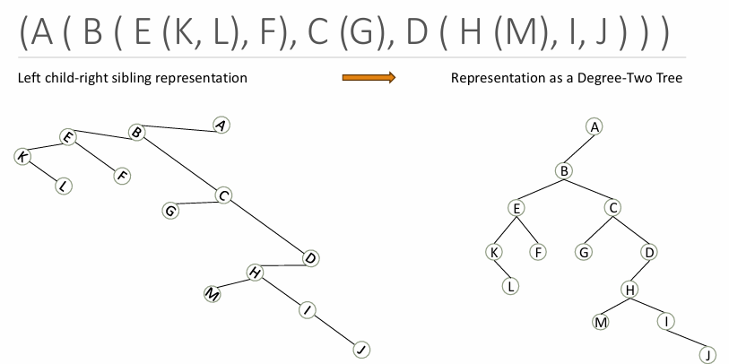

# Trees(樹)

這份文件整理了樹 (Trees) 這種非線性階層式資料結構的核心概念、術語、類型和操作。

## 核心定義與概念

* **定義**：樹是一種**非線性階層式資料結構**，由透過邊（Edges）連接的節點（Nodes）組成。
* **特性**：
    * 每個節點可以有零個或多個子節點，形成父子關係。
    * 樹中**沒有循環 (cycles)**。
    * 用於表示像檔案系統或組織結構這類的階層式關係。
* **樹在日常生活中的應用**:
    * 家族樹 (Family tree)。
    * 檔案系統階層 (File system hierarchy)。

---
## 樹的基本術語 (Terminology)

樹的基本元件包括節點 (root, internal, leaf, parent, child, sibling)、邊 (Edge)、子樹 (Subtree)、層級 (Level)、深度 (Depth) 和高度 (Height)。

| 術語 (Term) | 定義 (Definition) | 說明/關係 |
| :--- | :--- | :--- |
| **根節點 (Root)** | 樹的最頂層節點 | 一棵樹只有一個根節點|
| **葉節點 (Leaf)** | 沒有子節點的節點 | |
| **父節點 / 子節點** | 父節點是具有指向其他節點分支的節點 | 形成父子關係 |
| **兄弟節點 (Sibling)** | 共享同一父節點的節點 | |
| **邊 (Edge)** | 連接兩個節點的連線 | |
| **深度 (Depth)** | 距離根節點的距離 | |
| **高度 (Height)** | 到最遠葉節點的最長路徑 | |
| **分支度 (Fan-out=out-degree)** | 一個節點可以擁有的子節點數量 | |

---
## 樹的類型 (Types of Trees)
### 樹的演化階層 (General to Specialized)

| Level | Name | Extra rule compared to previous level | Type of constraint |
| :--- | :--- | :--- | :--- |
| **1** | **樹 (Tree)** | 僅是一個有根的階層結構，對子節點數量無限制 | Very general shape |
| **2** | **二元樹 (Binary Tree)** | 每個節點最多有 2 個子節點 (left/right) | Shape constraint (arity) |
| **3** | **二元搜尋樹 (BST)** | 每個節點：左子樹 $<$ 節點 $<$ 右子樹 | Ordering (search) invariant |
| **4** | **平衡 BST (AVL, Red-Black)** | 高度保持在 $(\approx \log n)$ 附近 | Height / balance invariant |

### 核心/基礎類型

| 類型 (Type) | 描述 (Description) | 應用 (Application) |
| :--- | :--- | :--- |
| **滿二元樹 (Full Binary Tree)** | 每個節點都有 0 個或 2 個子節點 | 機器學習中的決策節點 |
| **完全二元樹 (Complete Binary Tree)** | 除最後一層外，所有層級都被填滿 | 堆積 (Heap) / 優先佇列 |
| **AVL 樹** | 高度差異 $\le 1$ | 快速查找 (Fast lookup) |
| **紅黑樹** | 透過顏色約束平衡 | C++ STL map, Linux 核心 |
| **字典樹 (Trie)** | 基於字元的分支，快速字串檢索 | Dictionary words, auto-complete |

### 進階類型

| 類型 (Type) | 描述 (Description) | 應用 (Application) |
| :--- | :--- | :--- |
| **B-Tree / B+ Tree** | 為磁碟儲存設計的多路搜尋樹 | 資料庫、檔案系統 |
| **堆積樹 (Heap Tree)** | 是一種完全樹，父節點 $\ge$ 或 $\le$ 子節點 | 優先佇列 (Priority queue) |
| **KD-Tree** | 用於 k 維資料的空間分割 | 最近鄰搜尋 (ML) |

---
## 樹的遍歷 (Tree Traversal)

遍歷是按照特定順序訪問每個節點的過程。

### 深度優先遍歷 (Depth-First Traversal, DFT)

| 順序 (Order) | 訪問序列 (Visit Sequence) | 用途 (Description) |
| :--- | :--- | :--- |
| **前序 (Preorder)** | 根節點首先，然後是子節點 (Root-Left-Right) |用於複製樹 (copying trees) |
| **中序 (Inorder)** | 左子樹、根節點、右子樹 (Left-Root-Right) | 對 BST 來說是排序後的順序 |
| **後序 (Postorder)** | 子節點首先，根節點最後 (Left-Right-Root) | 用於刪除或釋放記憶體 (deletion or freeing memory) |

### 廣度優先遍歷 (Breadth-First Traversal, BFT)

* 也稱為：**層級順序遍歷 (Level-Order Traversal)**
* 實現方式：逐層訪問節點，使用**queue** 實現

---
## 樹的表示
* List representation

* Left child-right sibling representation

* Representation as a degree-two tree
 
      
---
## 二元搜尋樹 (BST) 的效能與操作

### 效能與平衡

* **問題**：如果 BST 變成**傾斜 (Skewed) / 退化 (Degenerate)**，搜尋和插入操作的複雜度會從 $O(\log n)$ 降級到 $O(n)$
* **平衡 (Balance)**：維持 $\log$ 尺度的樹高，以確保效率

| 操作 (Operation) | 平衡 BST (Balanced) | 傾斜 BST (Skewed/Worst-case) |
| :--- | :--- | :--- |
| **插入 (Insertion)** | $O(\log n)$ | $O(n)$ |
| **刪除 (Deletion)** | $O(\log n)$ | $O(n)$ |
| **遍歷 (Traversal)** | $O(n)$ | $O(n)$ |

### 內部節點刪除策略 (Two Children Case)

刪除具有兩個子節點的內部節點時，必須使用以下兩種替換選項之一，以保持 BST 屬性 ($left<parent<right$)

1. **選項 A**：用**左子樹中的最大值** (Max in left subtree) 替換。這被稱為**inorder predecessor**
2. **選項 B**：用**右子樹中的最小值** (Min in right subtree) 替換。這被稱為**inorder successor**
